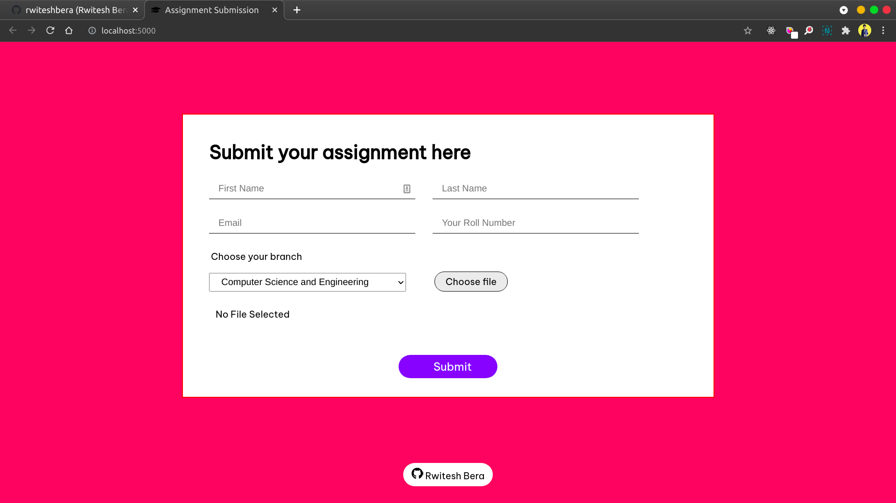

## Assignment Submission App
### Developer Days Week 3

Install node_modules using this command:
```
npm install
```

Run the app using this command:
```
npm start
```

Then open [http://localhost:5000](http://localhost:5000) in your browser.

#### How the app works:
1. The app will ask students to enter their name, email address, roll, branch and to upload assignment file.
2. After submitting assignment, the app will generate a local mongo database and store the form data as BSON documents.
3. Uploaded files are stored in a `/uploads` folder in the root of the project.


#### Screenshots: 

