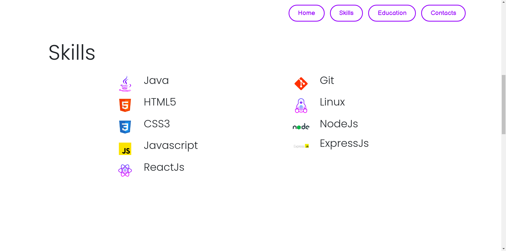
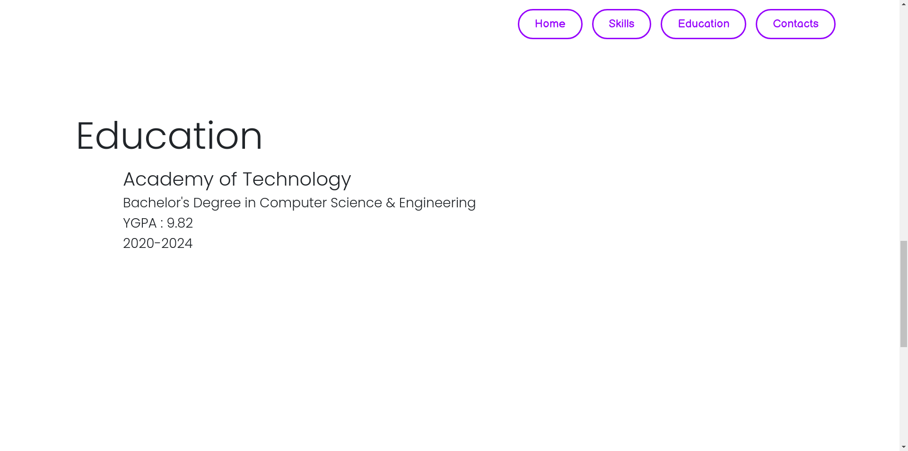
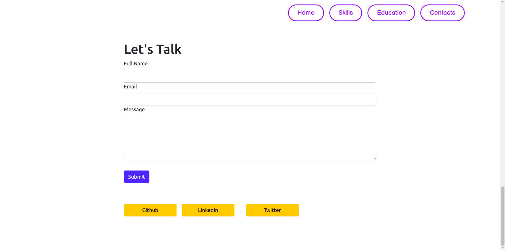

# Portfolio
### Developer Days - Week 1

## Deployment
To run any React application, you must have NodeJS and npm installed on our system. npm is distributed with nodejs which means that when you download NodeJS, you automatically get npm installed on your computer. So, the very first step will be to install NodeJS. 


#### NodeJS Download Link: https://nodejs.org/en/

To deploy this project install all the required dependecies and run by using the following commands.

```bash
  npm install
  npm start
```
Then open http://localhost:3000/ to see the app.

## Screenshots






## Feedback

If you have any feedback, please reach out to me at rwiteshbera@gmail.com

  

  